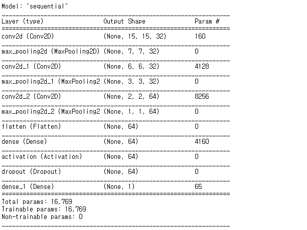

# speech_recognition-MFCC-CNN
 Speech recognition using MFCC and CNN. 
구글에서 제공하는 1초짜리 음성 데이터 셋을 이용하여 1. 음성을 데이터로 바꾸고 그 후에 2. CNN 방식을 이용하여 모델에 담는다. 그 후에 다시 3. tensorflow lite를 이용하여 경량화 시킨다.

## 설치

1. python 버전에 맞는 Anaconda 설치

2. Anaconda에 tensorflow 설치

   > pip install tensorflow

3. Anaconda에서 jupyter notebook 실행

   > jupyter notebook

4. github에 있는 ipynb 파일을 실행

## 사용법

1. **MFCC.ipynb** 파일은 오디오 데이터 셋의 음성을 이미지로 바꾸는 파일입니다.

아래의 그림은 'five'라고 말한 오디오 샘플의 MFCC 결과값 이미지입니다.

2. **image-Classification.ipynb** 파일은 keras를 이용한 이미지분류를 해서 모델링을 합니다.

아래의 이미지처럼 모델을 확인 할 수 있습니다.

아래의 이미지처럼 정확도를 확인 할 수 있습니다.

## 기여

Pull requests는 언제나 환영합니다. 사실 위의 모델은 현재 좋은 정확도가 모델은 아닙니다. 그러나 음성인식관련 자료가 많이 없고 집입장벽이 높기 때문에, 처음 공부하시는 분들께서는 상세히 코드 설명을 적어 놨기 때문에 공부하기엔 최적화된 코드라 생각이 됩니다.

## 라이센스

MIT

## Commit

| Nick Name      | ID(Github Link Address)                     | Total PR Count |
| -------------- | ------------------------------------------- | -------------- |
| ChangHyun Kang | [aaakch0316](https://github.com/aaakch0316) | maintainer     |
